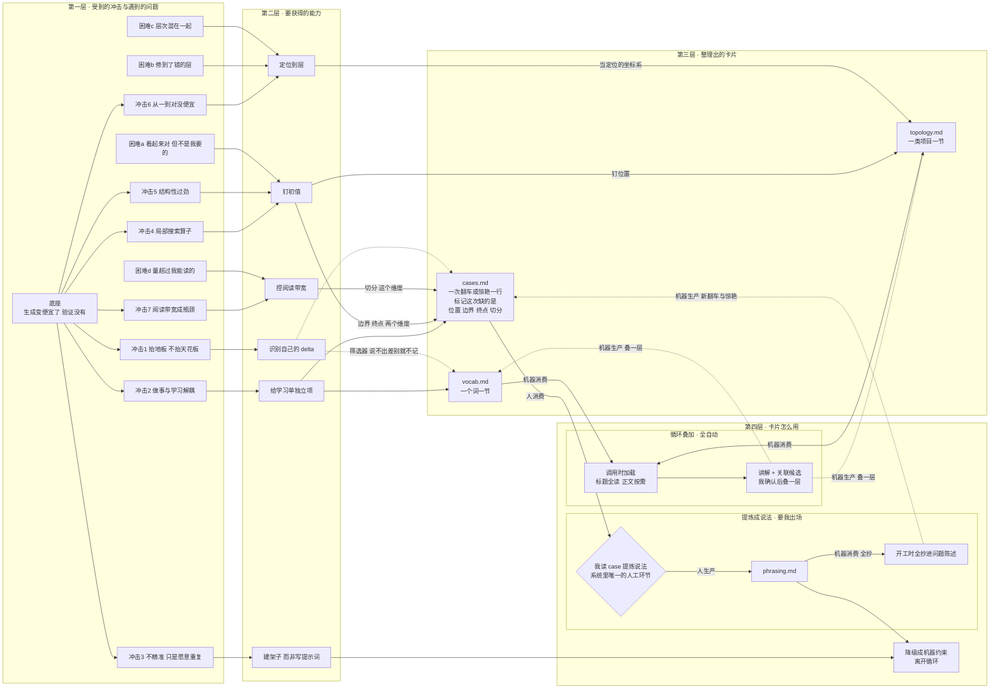

# 这些卡片为什么长这样

读一次就够，不用维护。

## 四层总图

横向从左到右是四层：**受到的冲击 → 要获得的能力 → 整理出的卡片 → 卡片怎么用**。

第四层分成两个循环：词汇和拓扑靠**循环叠加**（机器生产、机器消费），案例靠**提炼成说法**（机器生产、人消费；人生产、机器消费）。

前两层是一次性的推导，后两层是两个转速不同的循环。**卡片被用掉才会长出新卡片。**

---

# 第一层：AI 造成了什么冲击

## 底座：生成变便宜了，验证没有

写出一份看起来对的代码／方案／文档，边际成本趋近于零；但确认它是对的、决定它值不值得写、把它嵌进一个必须继续运行的系统里，成本一点没降。

下面所有冲击都是这一条的下游。这也是为什么能力清单不该是几条并列的条目——它们可以从这一条推出来。

## 冲击 1：AI 抬的是地板，不是天花板

AI 大致是互联网的平均值，擅长中位解，不擅长长尾。这解释了为什么初学者进入行业变容易（中位解高于新手），也解释了"做完什么都没留下"（交付物全部落在地板上，而地板不属于任何人）。

推论：任何 AI 能做到中位水平的事，都不再构成个人能力资产。个人价值只存在于中位之上的 delta 里。

**自检问句：这件事如果换个人 + 同一个模型，结果会差多少？** 差不多，就说明这次没有产生我的价值。

## 冲击 2："做事"和"学习"解耦了

以前学习是工作的免费副产品：不理解就跑不起来，交付即掌握。现在这个耦合断了——可以在不理解的情况下交付。

关键是激励结构变了：过去偷懒立刻被现实惩罚，现在偷懒被奖励（更快交付），惩罚延迟到几个月后发现自己没有判断力。

所以任何依赖"我要更努力思考"的解法都会失效。**学习必须变成流程里的强制环节。**

## 冲击 3：AI 不精准，它只是愿意重复

它本质是采样，同样输入两次输出不同。精准从来不是模型给的，是模型外面的架子给的：类型、测试、lint、CI、脚本、hook。

确定性由工具提供，创造性由模型提供。把"精准"归因给模型，就会倾向于用提示词去解决本该用工具解决的问题。

## 冲击 4：它是局部搜索算子，所以会收敛到局部最优

它沿着"让这个 diff 通过"的梯度下降，而不是"让这个设计正确"。上下文窗口就是它的整个世界，所以打补丁在分布内、推翻重来在分布外——它结构性地偏好前者。

初值（问题陈述与约束）决定收敛质量。重启成本对 AI 几乎为零，沉没成本只存在于人这一侧。

## 冲击 5：它会做得过劲，而且这是结构性的

训练目标让"多做一点、显得更完备"始终占优，而它不知道人的成本函数里"改动面积"是有代价的。

所以过劲不是偶发失误，是默认行为。不显式写反目标，它一定会过劲。

## 冲击 6："从零到一"便宜了，"从一到对"几乎没便宜

第一版是免费的，但第一版几乎从不是终版。真实工作量全在第 2 到第 N 版，而这部分效率几乎完全由能不能精确定位决定。

## 冲击 7：阅读带宽成了新瓶颈，而且提速无解

AI 的输出速度是人阅读速度的几十倍。把自己的瓶颈跟它的吞吐量做线性绑定，没有胜算。要练的不是读长文本，是要求它输出最小可检验单元。

## 四类反复出现的困难

上面这些冲击在日常里的具体形态，也是 `cases.md` 的标签。

- **(a)** 生成的内容看起来是对的，但和我需求不一样
- **(b)** 包装了很多层，错误去了错误的层
- **(c)** 把不同层次的概念混在一起，造成混乱
- **(d)** review 需要 review 的东西太多，超过了我的阅读能力

---

# 第二层：需要培养什么能力

如果生成便宜、验证没便宜，那稀缺资源只有一个：**我的验证带宽**。所有能力都是在做同一件事的三种方式——减少要验证的量、降低单位验证成本、把验证转移给机器。再加一层元能力，因为前三类不会自己从交付里长出来。

## 六种能力

**钉初值**（冲击 4、5）。初值决定收敛，而它默认会过劲。拓扑钉位置，反目标钉边界，验收钉终点——三个切面，一个能力。

**控阅读带宽**（冲击 7、困难 d）。和验收是两回事：验收回答"做完了没有"，切分回答"一次给我多少"。宁可要五个 30 行的 diff，也不要一个 300 行的。

**定位到层**（冲击 6、困难 b）。这个能力寄生在拓扑上。拓扑真正的价值不是对抗"AI 喜欢包很多层"，而是**给"哪儿不对"提供坐标系**——没有分层的心智模型，我只能说"这不对"，而"这不对"会让它在错误的层上继续打补丁。

**建架子而非写提示词**（冲击 3）。唯一能把验证成本真正降到零的一类，其余几类只是让我省点力。所以 `phrasing.md` 底部那一节才是整个库的出口。

**给学习单独立项**（冲击 2）。既然依赖意愿必然失效，那写入必须由固定事件触发、当场发生、成本极低。**"记下来等有空再整理"违反这一条：等有空是意愿，事后整理是意愿。** 这条也否掉了任何需要填字段的表单——字段越多，用它的成本越高，最后它会死在同一个地方。

**识别自己的 delta**（冲击 1）。自检句不只是自检，它是筛选器：只有"换个人加同一个模型会差很多"的时刻才值得记。这是唯一能防止库长成景观的东西。

## 生产者与消费者

| 卡片 | 生产者 | 消费者 | 利用方式 |
|---|---|---|---|
| `vocab.md` | skill | skill | 循环叠加 |
| `topology.md` | skill | skill | 循环叠加 |
| `cases.md` | skill | **我** | 攒着，等我提炼 |
| `phrasing.md` | **我** | skill | 开工时全抄 |

人只出现两次，而且这两次是连着的：**读 `cases.md`，写 `phrasing.md`**。除此之外整条链都是机器写、机器读。

这一条同时说明了三件事。系统的自动化程度已经到顶了——再往前一步就会吃掉那个唯一的人工环节，也就是冲击 1 里说的 delta。要判断这套东西有没有在退化，只看那一步还在不在。以及，如果哪天我觉得累，问题一定出在那一步之外的地方，因为别的地方本来就不该花我的注意力。

## 两个转速不同的循环

**词汇和拓扑：循环叠加，全自动。** 消费和生产是同一个动作——我一问，skill 先加载已有的，讲解时顺带提关联候选，我确认之后它就叠一层。卡片每被用一次就厚一层，不需要我另外做什么。

**案例到说法：要我出场。** 消费和生产分开了。案例由对话自动生产，攒在那里；只有我读过、比较过，才会变成说法；说法再被开工时全抄回去，产生新的案例。这个循环转得慢得多，而且中间那一步没法自动。

两个循环的转速差就是它们该不该自动的原因：叠一层是当场就知道的事实，提炼一条说法要跨好几条案例比较。

## 第三层和第四层的分界

**一条记录如果需要看别的记录才能写，就不该自动写。**

`vocab.md` 一行只需要这次对话，`topology.md` 一层只需要这次项目，`cases.md` 一行只需要这次翻车——都是当场就知道的事实，交给 skill 自动落笔，我不用付任何注意力。这是第三层。

`phrasing.md` 一条要三次案例才立得住。它是跨条目的比较和判断，也就是冲击 1 里说的中位之上的 delta。**让 skill 替我提炼说法，等于把我唯一产生价值的动作外包掉**——那我又回到了"交付了但什么都没留下"。这是第四层，只能我自己做。

能力决定 `cases.md` 上有哪几个维度（位置、边界、终点、切分），案例攒够了才决定 `phrasing.md` 里每个维度下有哪几条。前者是推导出来的，固定；后者是攒出来的，会长。

顺带一个推论：能自动化的积累和不能自动化的应用之间那条线，正好就是我的能力边界。线在哪，我的价值就在哪。

## 有些错误装不了架子

方向错了、层次选错了、需求理解偏了、取舍判断错了——这四类没有任何机械约束能挡。它们正好圈出我必须亲自出场的范围，也就是 delta 所在的地方。

如果发现自己在给这几类装架子，那是"用工具解决本该用判断解决的问题"，和"用提示词解决本该用工具解决的问题"是同一个错误的镜像。
